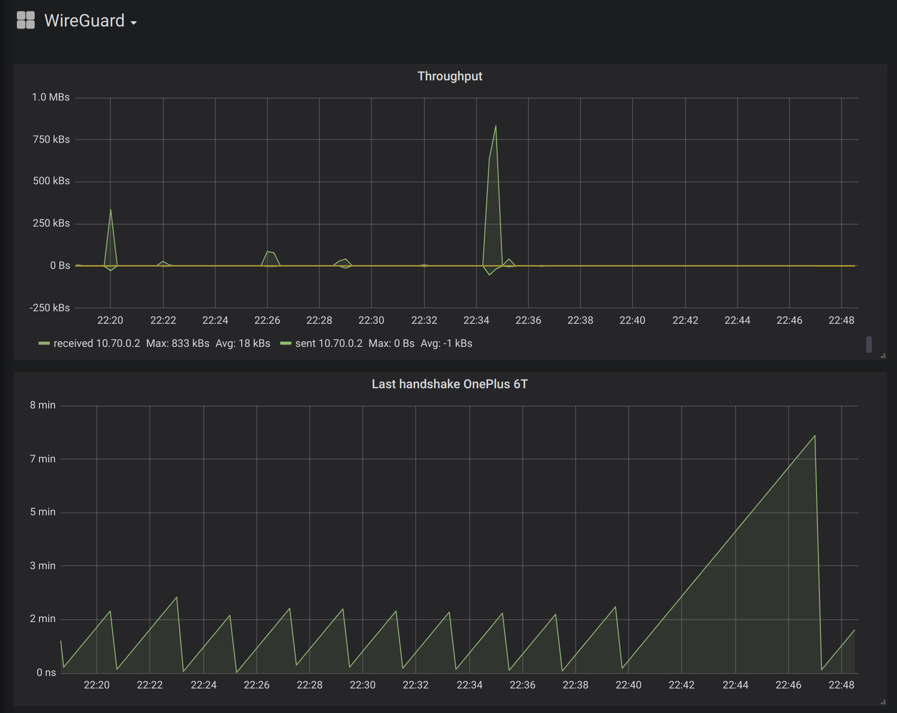

# Prometheus WireGuard Exporter

[](LICENSE)  

[](https://crates.io/crates/prometheus_wireguard_exporter) [](https://crates.io/crates/prometheus_wireguard_exporter) [](https://crates.io/crates/prometheus_wireguard_exporter)

[](https://github.com/MindFlavor/prometheus_wireguard_exporter/tree/0.1.0)
[](https://github.com/MindFlavor/prometheus_wireguard_exporter/tree/0.1.0)
[](https://img.shields.io/github/commits-since/mindflavor/prometheus_wireguard_exporter/0.1.0.svg)

## Intro

A Prometheus exporter for [WireGuard](https://www.wireguard.com), written in Rust. This tool exports the `wg show all dump` results in a format that [Prometheus](https://prometheus.io/) can understand. The exporter is very light on your server resources, both in terms of memory and CPU usage. 



## Prerequisites 

* You need [Rust](https://www.rust-lang.org/) to compile this code. Simply follow the instructions on Rust's website to install the toolchain. If you get weird errors while compiling please try and update your Rust version first (I have developed it on `rustc 1.35.0-nightly (8159f389f 2019-04-06)`).
* You need [WireGuard](https://www.wireguard.com) *and* the `wg` CLI in the path. The tool will call `wg show all dump` and of course will fail if the `wg` executable is not found. If you want I can add the option of specifying the `wg` path in the command line, just open an issue for it.

## Compilation

To compile the latest master version:

```bash
git clone https://github.com/MindFlavor/prometheus_wireguard_exporter.git
cd prometheus_wireguard_exporter
cargo install --path .
```

If you want the latest release you can simply use:

```bash
cargo install prometheus_wireguard_exporter
```

## Usage

Start the binary with `-h` to get the complete syntax. The parameters are:

| Parameter | Mandatory | Valid values | Default | Description |
| -- | -- | -- | -- | -- | 
| `-v` | no | <switch> | | Enable verbose mode.
| `-p` | no | any valid port number | 9576 | Specify the service port. This is the port your Prometheus instance should point to.

Once started, the tool will listen on the specified port (or the default one, 9576, if not specified) and return a Prometheus valid response at the url `/metrics`. So to check if the tool is working properly simply browse the `http://localhost:9576` (or whichever port you choose).

### Systemd service file

Now add the exporter to the Prometheus exporters as usual. I recommend to start it as a service. It's necessary to run it as root (if there is a non-root way to call `wg show all dump` please let me know). My systemd service file is like this one:

```
[Unit]
Description=Prometheus WireGuard Exporter
Wants=network-online.target
After=network-online.target

[Service]
User=root
Group=root
Type=simple
ExecStart=/usr/local/bin/prometheus_wireguard_exporter

[Install]
WantedBy=multi-user.target
```
