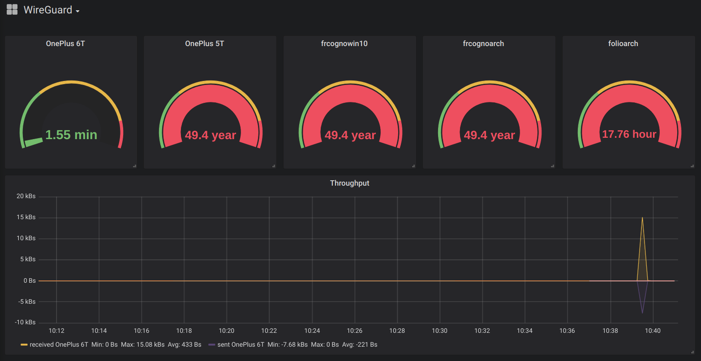

# Prometheus WireGuard Exporter

[](LICENSE)  

[](https://crates.io/crates/prometheus_wireguard_exporter) [](https://crates.io/crates/prometheus_wireguard_exporter) [](https://crates.io/crates/prometheus_wireguard_exporter)

[](https://github.com/MindFlavor/prometheus_wireguard_exporter/tree/2.0.0)
[](https://github.com/MindFlavor/prometheus_wireguard_exporter/tree/2.0.0)
[](https://img.shields.io/github/commits-since/mindflavor/prometheus_wireguard_exporter/2.0.0.svg)

## Intro

A Prometheus exporter for [WireGuard](https://www.wireguard.com), written in Rust. This tool exports the `wg show all dump` results in a format that [Prometheus](https://prometheus.io/) can understand. The exporter is very light on your server resources, both in terms of memory and CPU usage. 



## Prerequisites 

* You need [Rust](https://www.rust-lang.org/) to compile this code. Simply follow the instructions on Rust's website to install the toolchain. If you get weird errors while compiling please try and update your Rust version first (I have developed it on `rustc 1.35.0-nightly (8159f389f 2019-04-06)`).
* You need [WireGuard](https://www.wireguard.com) *and* the `wg` CLI in the path. The tool will call `wg show all dump` and of course will fail if the `wg` executable is not found. If you want I can add the option of specifying the `wg` path in the command line, just open an issue for it.

## Compilation

To compile the latest master version:

```bash
git clone https://github.com/MindFlavor/prometheus_wireguard_exporter.git
cd prometheus_wireguard_exporter
cargo install --path .
```

If you want the latest release you can simply use:

```bash
cargo install prometheus_wireguard_exporter
```

## Usage

Start the binary with `-h` to get the complete syntax. The parameters are:

| Parameter | Mandatory | Valid values | Default | Description |
| -- | -- | -- | -- | -- | 
| `-v` | no | <switch> | | Enable verbose mode.
| `-p` | no | any valid port number | 9586 | Specify the service port. This is the port your Prometheus instance should point to.
| `-n` | no | path to the wireguard configuration file | | This flag adds the *friendly_name* attribute to the exported entries. See [Friendly names](#friendly-names) for more details.

Once started, the tool will listen on the specified port (or the default one, 9586, if not specified) and return a Prometheus valid response at the url `/metrics`. So to check if the tool is working properly simply browse the `http://localhost:9586/metrics` (or whichever port you choose).

## Friendly Names

Starting from version 1.2 you can instruct the exporter to append a *friendly name* to the exported entries. This can make the output more understandable than using the public keys. For example this is the standard output:

```
# HELP wireguard_sent_bytes_total Bytes sent to the peer
# TYPE wireguard_sent_bytes_total counter
wireguard_sent_bytes_total{inteface="wg0", public_key="2S7mA0vEMethCNQrJpJKE81/JmhgtB+tHHLYQhgM6kk=", local_ip="10.70.0.2", local_subnet="32"} 111612260
wireguard_sent_bytes_total{inteface="wg0", public_key="qnoxQoQI8KKMupLnSSureORV0wMmH7JryZNsmGVISzU=", local_ip="10.70.0.3", local_subnet="32"} 0
wireguard_sent_bytes_total{inteface="wg0", public_key="L2UoJZN7RmEKsMmqaJgKG0m1S2Zs2wd2ptAf+kb3008=", local_ip="10.70.0.4", local_subnet="32"} 29704
wireguard_sent_bytes_total{inteface="wg0", public_key="MdVOIPKt9K2MPj/sO2NlWQbOnFJ6L/qX80mmhQwsUlA=", local_ip="10.70.0.50", local_subnet="32"} 0
wireguard_sent_bytes_total{inteface="wg0", public_key="lqYcojJMsIZXMUw1heAFbQHBoKjCEaeo7M1WXDh/KWc=", local_ip="10.70.0.40", local_subnet="32"} 333612100
wireguard_sent_bytes_total{inteface="wg0", public_key="928vO9Lf4+Mo84cWu4k1oRyzf0AR7FTGoPKHGoTMSHk=", local_ip="10.70.0.80", local_subnet="32"} 37732
wireguard_sent_bytes_total{inteface="wg0", public_key="wTjv6hS6fKfNK+SzOLo7O6BQjEb6AD1TN9GjwZ08IwA=", local_ip="10.70.0.5", local_subnet="32"} 28678984
# HELP wireguard_received_bytes_total Bytes received from the peer
# TYPE wireguard_received_bytes_total counter
wireguard_received_bytes_total{inteface="wg0", public_key="2S7mA0vEMethCNQrJpJKE81/JmhgtB+tHHLYQhgM6kk=", local_ip="10.70.0.2", local_subnet="32"} 814015520
wireguard_received_bytes_total{inteface="wg0", public_key="qnoxQoQI8KKMupLnSSureORV0wMmH7JryZNsmGVISzU=", local_ip="10.70.0.3", local_subnet="32"} 0
wireguard_received_bytes_total{inteface="wg0", public_key="L2UoJZN7RmEKsMmqaJgKG0m1S2Zs2wd2ptAf+kb3008=", local_ip="10.70.0.4", local_subnet="32"} 69936
wireguard_received_bytes_total{inteface="wg0", public_key="MdVOIPKt9K2MPj/sO2NlWQbOnFJ6L/qX80mmhQwsUlA=", local_ip="10.70.0.50", local_subnet="32"} 0
wireguard_received_bytes_total{inteface="wg0", public_key="lqYcojJMsIZXMUw1heAFbQHBoKjCEaeo7M1WXDh/KWc=", local_ip="10.70.0.40", local_subnet="32"} 1022815448
wireguard_received_bytes_total{inteface="wg0", public_key="928vO9Lf4+Mo84cWu4k1oRyzf0AR7FTGoPKHGoTMSHk=", local_ip="10.70.0.80", local_subnet="32"} 62908
wireguard_received_bytes_total{inteface="wg0", public_key="wTjv6hS6fKfNK+SzOLo7O6BQjEb6AD1TN9GjwZ08IwA=", local_ip="10.70.0.5", local_subnet="32"} 1261474420
# HELP wireguard_latest_handshake_seconds Seconds from the last handshake
# TYPE wireguard_latest_handshake_seconds gauge
wireguard_latest_handshake_seconds{inteface="wg0", public_key="2S7mA0vEMethCNQrJpJKE81/JmhgtB+tHHLYQhgM6kk=", local_ip="10.70.0.2", local_subnet="32"} 1559314162
wireguard_latest_handshake_seconds{inteface="wg0", public_key="qnoxQoQI8KKMupLnSSureORV0wMmH7JryZNsmGVISzU=", local_ip="10.70.0.3", local_subnet="32"} 0
wireguard_latest_handshake_seconds{inteface="wg0", public_key="L2UoJZN7RmEKsMmqaJgKG0m1S2Zs2wd2ptAf+kb3008=", local_ip="10.70.0.4", local_subnet="32"} 1559313782
wireguard_latest_handshake_seconds{inteface="wg0", public_key="MdVOIPKt9K2MPj/sO2NlWQbOnFJ6L/qX80mmhQwsUlA=", local_ip="10.70.0.50", local_subnet="32"} 0
wireguard_latest_handshake_seconds{inteface="wg0", public_key="lqYcojJMsIZXMUw1heAFbQHBoKjCEaeo7M1WXDh/KWc=", local_ip="10.70.0.40", local_subnet="32"} 1559210171
wireguard_latest_handshake_seconds{inteface="wg0", public_key="928vO9Lf4+Mo84cWu4k1oRyzf0AR7FTGoPKHGoTMSHk=", local_ip="10.70.0.80", local_subnet="32"} 1558851920
wireguard_latest_handshake_seconds{inteface="wg0", public_key="wTjv6hS6fKfNK+SzOLo7O6BQjEb6AD1TN9GjwZ08IwA=", local_ip="10.70.0.5", local_subnet="32"} 1559313713
```

And this is the one augmented with friendly names:

```
# HELP wireguard_sent_bytes_total Bytes sent to the peer
# TYPE wireguard_sent_bytes_total counter
wireguard_sent_bytes_total{inteface="wg0", public_key="2S7mA0vEMethCNQrJpJKE81/JmhgtB+tHHLYQhgM6kk=", local_ip="10.70.0.2", local_subnet="32", friendly_name="OnePlus 6T"} 111612260
wireguard_sent_bytes_total{inteface="wg0", public_key="qnoxQoQI8KKMupLnSSureORV0wMmH7JryZNsmGVISzU=", local_ip="10.70.0.3", local_subnet="32", friendly_name="varch.local (laptop)"} 0
wireguard_sent_bytes_total{inteface="wg0", public_key="L2UoJZN7RmEKsMmqaJgKG0m1S2Zs2wd2ptAf+kb3008=", local_ip="10.70.0.4", local_subnet="32", friendly_name="cantarch"} 29704
wireguard_sent_bytes_total{inteface="wg0", public_key="MdVOIPKt9K2MPj/sO2NlWQbOnFJ6L/qX80mmhQwsUlA=", local_ip="10.70.0.50", local_subnet="32", friendly_name="frcognoarch"} 0
wireguard_sent_bytes_total{inteface="wg0", public_key="lqYcojJMsIZXMUw1heAFbQHBoKjCEaeo7M1WXDh/KWc=", local_ip="10.70.0.40", local_subnet="32", friendly_name="frcognowin10"} 333612100
wireguard_sent_bytes_total{inteface="wg0", public_key="928vO9Lf4+Mo84cWu4k1oRyzf0AR7FTGoPKHGoTMSHk=", local_ip="10.70.0.80", local_subnet="32", friendly_name="OnePlus 5T"} 37732
wireguard_sent_bytes_total{inteface="wg0", public_key="wTjv6hS6fKfNK+SzOLo7O6BQjEb6AD1TN9GjwZ08IwA=", local_ip="10.70.0.5", local_subnet="32", friendly_name="folioarch"} 28678984
# HELP wireguard_received_bytes_total Bytes received from the peer
# TYPE wireguard_received_bytes_total counter
wireguard_received_bytes_total{inteface="wg0", public_key="2S7mA0vEMethCNQrJpJKE81/JmhgtB+tHHLYQhgM6kk=", local_ip="10.70.0.2", local_subnet="32", friendly_name="OnePlus 6T"} 814015520
wireguard_received_bytes_total{inteface="wg0", public_key="qnoxQoQI8KKMupLnSSureORV0wMmH7JryZNsmGVISzU=", local_ip="10.70.0.3", local_subnet="32", friendly_name="varch.local (laptop)"} 0
wireguard_received_bytes_total{inteface="wg0", public_key="L2UoJZN7RmEKsMmqaJgKG0m1S2Zs2wd2ptAf+kb3008=", local_ip="10.70.0.4", local_subnet="32", friendly_name="cantarch"} 69936
wireguard_received_bytes_total{inteface="wg0", public_key="MdVOIPKt9K2MPj/sO2NlWQbOnFJ6L/qX80mmhQwsUlA=", local_ip="10.70.0.50", local_subnet="32", friendly_name="frcognoarch"} 0
wireguard_received_bytes_total{inteface="wg0", public_key="lqYcojJMsIZXMUw1heAFbQHBoKjCEaeo7M1WXDh/KWc=", local_ip="10.70.0.40", local_subnet="32", friendly_name="frcognowin10"} 1022815448
wireguard_received_bytes_total{inteface="wg0", public_key="928vO9Lf4+Mo84cWu4k1oRyzf0AR7FTGoPKHGoTMSHk=", local_ip="10.70.0.80", local_subnet="32", friendly_name="OnePlus 5T"} 62908
wireguard_received_bytes_total{inteface="wg0", public_key="wTjv6hS6fKfNK+SzOLo7O6BQjEb6AD1TN9GjwZ08IwA=", local_ip="10.70.0.5", local_subnet="32", friendly_name="folioarch"} 1261474420
# HELP wireguard_latest_handshake_seconds Seconds from the last handshake
# TYPE wireguard_latest_handshake_seconds gauge
wireguard_latest_handshake_seconds{inteface="wg0", public_key="2S7mA0vEMethCNQrJpJKE81/JmhgtB+tHHLYQhgM6kk=", local_ip="10.70.0.2", local_subnet="32", friendly_name="OnePlus 6T"} 1559314162
wireguard_latest_handshake_seconds{inteface="wg0", public_key="qnoxQoQI8KKMupLnSSureORV0wMmH7JryZNsmGVISzU=", local_ip="10.70.0.3", local_subnet="32", friendly_name="varch.local (laptop)"} 0
wireguard_latest_handshake_seconds{inteface="wg0", public_key="L2UoJZN7RmEKsMmqaJgKG0m1S2Zs2wd2ptAf+kb3008=", local_ip="10.70.0.4", local_subnet="32", friendly_name="cantarch"} 1559313782
wireguard_latest_handshake_seconds{inteface="wg0", public_key="MdVOIPKt9K2MPj/sO2NlWQbOnFJ6L/qX80mmhQwsUlA=", local_ip="10.70.0.50", local_subnet="32", friendly_name="frcognoarch"} 0
wireguard_latest_handshake_seconds{inteface="wg0", public_key="lqYcojJMsIZXMUw1heAFbQHBoKjCEaeo7M1WXDh/KWc=", local_ip="10.70.0.40", local_subnet="32", friendly_name="frcognowin10"} 1559210171
wireguard_latest_handshake_seconds{inteface="wg0", public_key="928vO9Lf4+Mo84cWu4k1oRyzf0AR7FTGoPKHGoTMSHk=", local_ip="10.70.0.80", local_subnet="32", friendly_name="OnePlus 5T"} 1558851920
wireguard_latest_handshake_seconds{inteface="wg0", public_key="wTjv6hS6fKfNK+SzOLo7O6BQjEb6AD1TN9GjwZ08IwA=", local_ip="10.70.0.5", local_subnet="32", friendly_name="folioarch"} 1559313713
```

In order for this to work, you need to add comments to your wireguard configuration file (below the `[Peer]` definition). The comment will be interpreted as `friendly_name` and added to the entry exported to Prometheus. Note that this is not a standard but, since it's a comment, will not interfere with WireGuard in any way. For example this is how you edit your WireGuard configuration file:

```
[Peer]
PublicKey = lqYcojJMsIZXMUw1heAFbQHBoKjCEaeo7M1WXDh/KWc=
AllowedIPs = 10.70.0.40/32

[Peer]
PublicKey = 928vO9Lf4+Mo84cWu4k1oRyzf0AR7FTGoPKHGoTMSHk=
AllowedIPs = 10.70.0.80/32
```

```
[Peer]
# frcognowin10
PublicKey = lqYcojJMsIZXMUw1heAFbQHBoKjCEaeo7M1WXDh/KWc=
AllowedIPs = 10.70.0.40/32

[Peer]
# OnePlus 5T
PublicKey = 928vO9Lf4+Mo84cWu4k1oRyzf0AR7FTGoPKHGoTMSHk=
AllowedIPs = 10.70.0.80/32
```

As you can see, all you need to do is to add the friendly name as comment (and enable the flag since this feature is opt-in).

### Systemd service file

Now add the exporter to the Prometheus exporters as usual. I recommend to start it as a service. It's necessary to run it as root (if there is a non-root way to call `wg show all dump` please let me know). My systemd service file is like this one:

```
[Unit]
Description=Prometheus WireGuard Exporter
Wants=network-online.target
After=network-online.target

[Service]
User=root
Group=root
Type=simple
ExecStart=/usr/local/bin/prometheus_wireguard_exporter -n /etc/wireguard/wg0.conf

[Install]
WantedBy=multi-user.target
```
